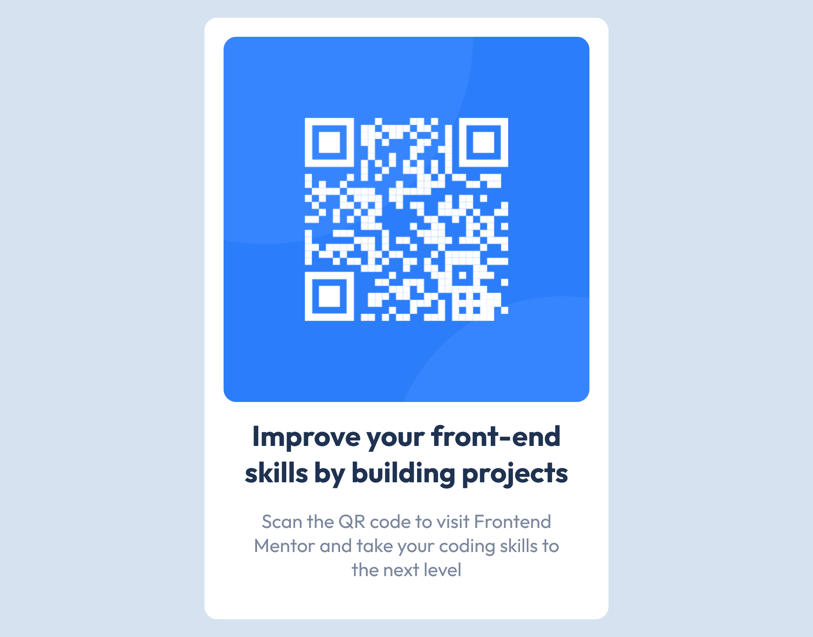

# Frontend Mentor - QR code component solution

This is a solution to the [QR code component challenge on Frontend Mentor](https://www.frontendmentor.io/challenges/qr-code-component-iux_sIO_H).

## Table of contents

- [Overview](#overview)
  - [Screenshot](#screenshot)
  - [Links](#links)
- [My process](#my-process)
  - [Built with](#built-with)
  - [What I learned](#what-i-learned)
  - [Useful resources](#useful-resources)
- [Author](#author)

## Overview

### Screenshot

### Links

- Solution URL: [QR Component Solution](http://127.0.0.1:5500/index.html)

## My process

### Built with

- Semantic HTML5 markup
- CSS custom properties

### Useful resources

- [w3schools](https://www.w3schools.com/html/) - This was really just an excellent resource for reminding myself of all the necessary html and css functionality.

## Author

- Frontend Mentor - [@KruxofParadox](https://www.frontendmentor.io/profile/KruxofParadox)
